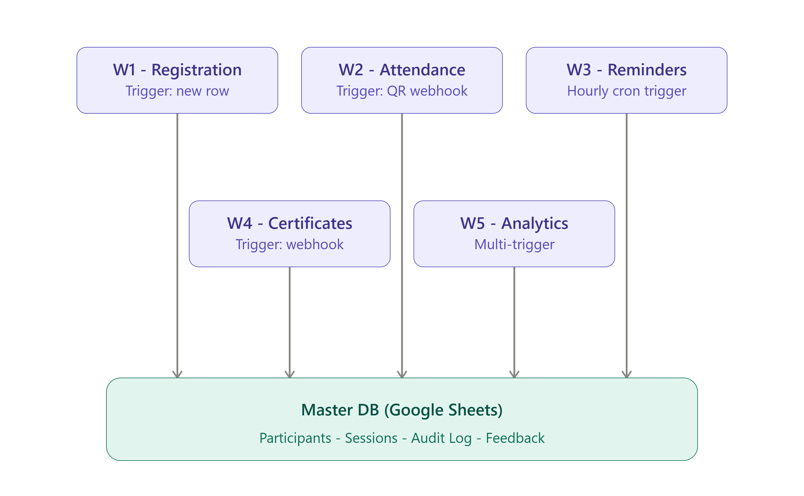
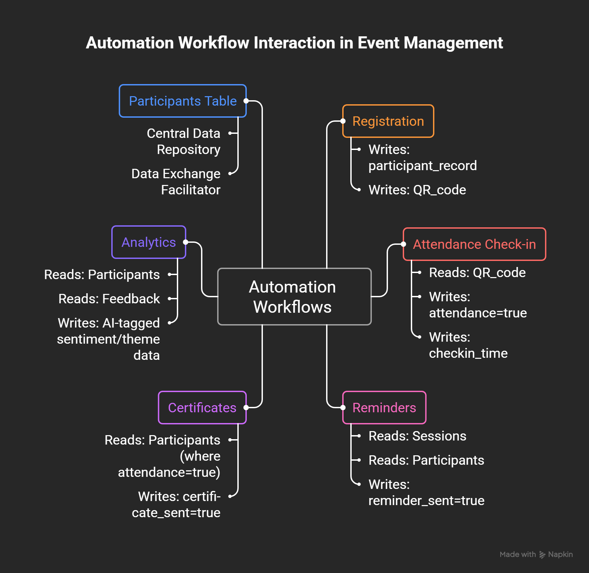
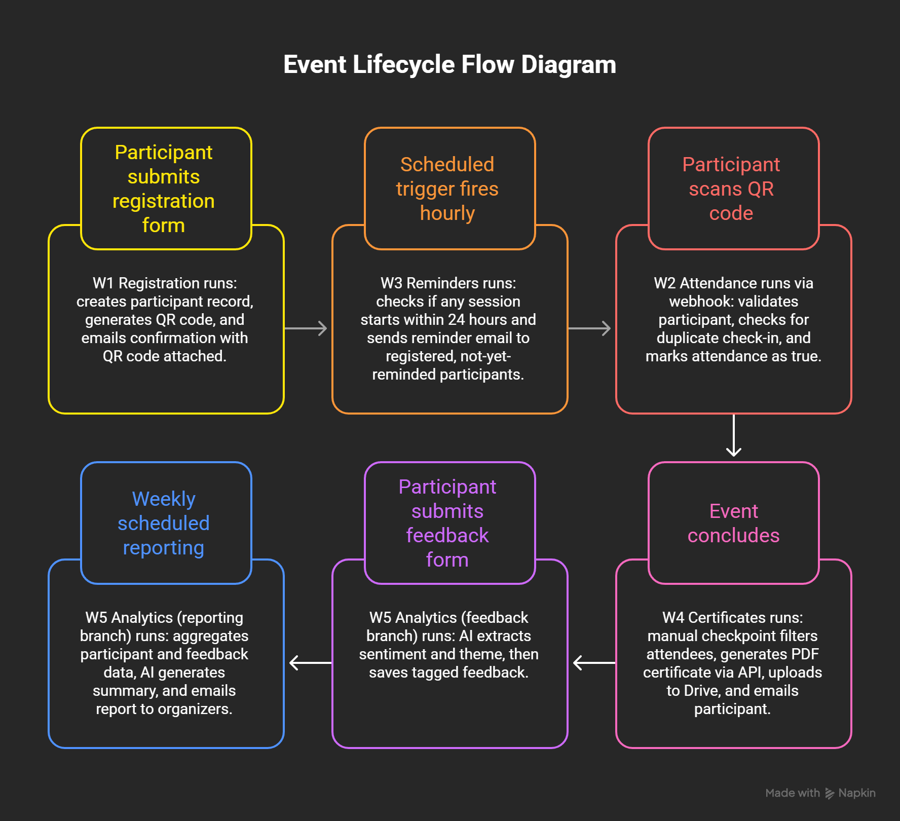

# AI-Powered Event Management Platform

An intelligent event automation solution built using **n8n** that streamlines the complete event lifecycle—from participant registration to post-event analytics. The platform automates registrations, QR-based attendance, reminder emails, certificate generation, and AI-assisted feedback analysis using multiple interconnected workflows.

Developed as part of the **Summer School '26 – n8n Capstone Project**.

---

## Overview

This project eliminates repetitive manual work involved in managing technical events, workshops, conferences, and hackathons.

The system automatically:

- Registers participants
- Prevents duplicate registrations
- Generates unique QR codes
- Sends confirmation emails
- Tracks attendance through QR scanning
- Sends session reminders
- Generates participation certificates
- Analyzes participant feedback using AI
- Delivers analytics reports to organizers

The entire solution is implemented using **five independent n8n workflows** connected through a shared Google Sheets database.

---

## System Architecture

The platform follows a modular workflow architecture where each workflow is responsible for a specific stage of the event lifecycle.

Rather than directly calling one another, all workflows communicate through a centralized Google Sheets database that acts as the **single source of truth**. The only direct dependency between workflows is the QR code generated during participant registration, which is later used for attendance verification.







For a detailed explanation of every workflow and node configuration, refer to:

**[`docs/02-workflow-documentation.md`](docs/02-Workflow-Documentation.md)**

---

## Workflow Summary

| Workflow | Trigger | Description |
|----------|---------|-------------|
| **Registration & Participant Management** | New registration row | Validates participant information, prevents duplicates, generates QR codes, uploads them to Google Drive, and sends confirmation emails. |
| **QR Attendance System** | Webhook (QR Scan) | Verifies participant identity, records attendance, blocks duplicate check-ins, and logs invalid scans. |
| **Reminder Automation** | Hourly Scheduler | Sends reminder emails for upcoming sessions and marks reminders to avoid duplicate notifications. |
| **Certificate Generation** | Event completion webhook | Generates personalized certificates using PDFMonkey, uploads them to Drive, emails participants, and updates records. |
| **Feedback & Analytics** | Feedback submission and scheduled trigger | Uses AI to classify participant feedback and generates weekly event analytics reports for organizers. |

---

## Technology Stack

### Automation

- n8n

### Database

- Google Sheets

### Cloud Services

- Google Drive
- Gmail

### External APIs

- PDFMonkey API
- QR Code API

### Artificial Intelligence

- OpenAI-compatible Large Language Model (LLM) for:
  - Sentiment Analysis
  - Theme Extraction
  - Analytics Report Generation

---

## Repository Structure

```text
├── docs/
│   ├── 01-problem-analysis.md
│   ├── 02-workflow-documentation.md
│   ├── architecture-diagram.png
│   ├── workflow-interaction-diagram.png
│   └── event-participant-lifecycle-diagram.png
│
├── workflows/
│   ├── W1-registration-participant-management.json
│   ├── W2-qr-attendance-checkin.json
│   ├── W3-event-reminders.json
│   ├── W4-certificate-generation.json
│   └── W5-feedback-analytics.json
│
├── screenshots/
│
└── demo/
    └── demo-video-link.md
```

---

## Installation

### Prerequisites

Before importing the workflows, ensure you have access to:

- An n8n instance (Cloud or Self-hosted)
- Google Sheets
- Google Drive
- Gmail
- PDFMonkey
- An OpenAI-compatible API

---

### Setup

1. Create the Google Sheets database with the required worksheets:

   - Registration
   - Participants
   - Sessions
   - Audit Log
   - Feedback
   - Feedback Form Responses

2. Import all workflow JSON files into your n8n workspace.

3. Configure credentials for:

   - Google Sheets
   - Google Drive
   - Gmail
   - PDFMonkey
   - OpenAI-compatible API

4. Replace all placeholder values including:

   - Spreadsheet IDs
   - Drive Folder IDs
   - PDFMonkey Template ID
   - API Keys

5. Activate all workflows.

6. Perform an end-to-end test by:

   - Registering a participant
   - Receiving the QR code
   - Scanning the QR code
   - Completing the event
   - Generating a certificate
   - Submitting feedback

---

## Design Decisions

Some notable implementation choices include:

- Modular workflow design for easier maintenance and scalability.
- Google Sheets used as the central database shared across workflows.
- QR-based attendance validation to prevent duplicate check-ins.
- Automated email communication throughout the participant lifecycle.
- AI-assisted sentiment analysis and report generation.
- Audit logging for invalid attendance attempts.
- Scheduled workflows for reminders and analytics.

---

## Current Limitations

- Certificate generation is initiated manually once an organizer confirms that the event has concluded.
- Duplicate detection relies on normalized participant information.
- AI-generated classifications depend on the quality of the underlying language model.

---

## Future Improvements

Possible enhancements include:

- Organizer dashboard
- SMS or WhatsApp notifications
- Calendar integration
- Multi-event management
- Live analytics dashboard
- Slack or Microsoft Teams notifications
- Automatic event completion detection

---

## Documentation

Additional project documentation is available below:

- [Problem Analysis](docs/01-Problem-Analysis.md)
- [Workflow Documentation](docs/02-Workflow-Documentation.md)
- [Project Presentation](docs/AI-Event-Management-Platform.pdf)

---

## Demo

A walkthrough of the project is available here:

[`demo/demo-video-link.md`](demo/demo-video-link.md)

---

## Author

Developed by **Akshit Chib** for the **Summer School '26 – n8n Capstone Project**.